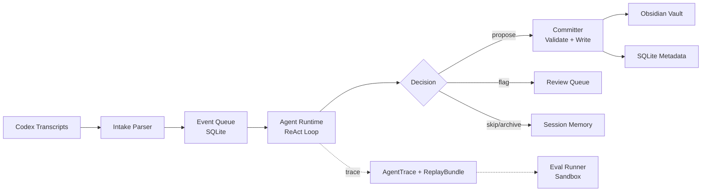

# Snowball Notes

An autonomous agent that curates AI conversation turns into a reviewable Obsidian knowledge base — with controlled side effects, full traceability, and deterministic replay.

## The Problem

Every long AI coding session produces dozens of turns. Some contain reusable knowledge (design decisions, debugging patterns, configuration rationale), while most are ephemeral (test runs, typo fixes, progress checks). Manually sifting through transcripts to extract notes is tedious, and naive automation creates three hard sub-problems:

1. **Same turn, mixed value.** A single turn can contain a reusable insight buried inside debugging chatter. The system must *observe* existing notes before deciding what to extract.
2. **Decision depends on context.** Whether a turn becomes a new note, an append to an existing note, or a skip depends on what's already in the knowledge base. Static rules can't cover the combinatorial space.
3. **Wrong writes are expensive.** A bad note pollutes the vault; a bad append corrupts an existing one. The cost of a false write far exceeds the cost of a missed one.

## Why Agent, Not Workflow

Four criteria push this from a pipeline into an agent architecture:

| Criterion | Implication |
|---|---|
| **Dynamic observation** | The agent searches the knowledge index mid-run to decide create vs. append vs. skip. The observation changes the next action. |
| **Multi-step reasoning** | Assess → Extract → Search → Read → Propose is not a fixed pipeline; the agent may loop back to search again after reading a candidate note. |
| **Graceful termination** | When uncertain, the agent flags for human review instead of guessing. This is a first-class decision, not an error path. |
| **Controlled side effects** | All writes go through a Proposal → Commit two-phase gate. The agent reasons freely; the Committer enforces invariants. |

## How It Is Controlled

### State Machine

Every task follows a strict lifecycle:

```
RECEIVED → PREPARED → RUNNING → PROPOSED_ACTIONS → COMMITTING → COMPLETED
                        ↓              ↓                ↓
                     FLAGGED        FLAGGED       FAILED_RETRYABLE
                     FAILED_*                     FAILED_FATAL
```

All transitions are validated against `VALID_TRANSITIONS`. Concurrent modification is detected via row-count checks.

### Two-Phase Commit

During the ReAct loop, tools like `propose_create_note` only append to an in-memory `ActionProposal` list — no vault or DB writes happen. After the loop, the `Committer` validates all proposals (write limits, confidence thresholds, duplicate detection, target existence) and then atomically writes to both SQLite and the Obsidian vault.

### Guardrails

Pre-execution checks on every tool call enforce hard limits independent of the LLM:

- `max_writes_per_run` — caps total write proposals per agent run
- `min_confidence_for_note` — blocks note creation below a confidence threshold
- `min_confidence_for_append` — blocks appends below a higher threshold
- `max_appends_per_run` — caps append proposals per run
- `project_meta_turn` detection — prevents project status discussions from becoming notes

### Trace + Replay

Every agent run produces an `AgentTrace` (structured decision log) and a `ReplayBundle` (frozen event + prompt + config + tool I/O + knowledge snapshot). Two replay modes enable post-hoc analysis:

- **Logical replay**: replays against frozen tool outputs to verify runtime determinism
- **Live replay**: replays against the current knowledge base to detect drift

## Architecture



**Key components:**

- **Intake** — Polls Codex session transcripts, scores `source_confidence`, and enqueues `StandardEvent`s
- **Agent Runtime** — ReAct loop with 9 tools (assess, extract, search, read, create, append, archive, link, flag)
- **Committer** — Two-phase validation and atomic write to vault + DB
- **Knowledge Index** — Hybrid retrieval: title similarity + body overlap + metadata overlap + embedding cosine
- **Eval Runner** — Sandboxed execution of annotated test cases with decision accuracy, safety, cost, and replay metrics
- **Review UI** — CLI and optional FastAPI server for human review of flagged cases

## Results

### `snowball status` output

```
Agent health (last 7 days):
  Runs: 42  Completed: 38  Flagged: 3  Failed: 1
  Avg steps/run: 3.8   Avg tokens: 412
  Write rate: 68%   Flag rate: 7%
Parser health:
  Events parsed: 156   Avg confidence: 0.87
  Below threshold: 12 (7.7%)
```

### Eval: Heuristic vs DeepSeek (25 cases, 6 decision types)

| Metric | Heuristic (offline) | DeepSeek-V3 |
|---|---|---|
| Decision accuracy | 76.0% | **88.0%** |
| Target note accuracy | 80.0% | **100.0%** |
| False write rate | 4.0% | 4.0% |
| **Unsafe merge rate** | **0.0%** | **50.0%** ⚠️ |
| Logical replay match | 100.0% | 100.0% |
| Live replay drift | 32.0% | 52.0% |
| Avg steps / run | 3.12 | 4.20 |
| Avg tokens / run | 262 | 8,102 |
| Avg duration / run | < 1 ms | 34 s |

**Key finding**: DeepSeek improves decision accuracy by +12pp and achieves perfect target note selection, but introduces unsafe merges in edge cases where a high-similarity note exists and confidence sits in the 0.70–0.85 range — above the guardrail threshold for `create_note` but below the threshold for `append_note`. The heuristic adapter is more conservative and avoids unsafe writes entirely, at the cost of lower decision accuracy. This illustrates that guardrail thresholds need to be tuned alongside model capability: a more capable model may find ways to take actions that rule-based guardrails don't anticipate.

Both adapters achieve **100% logical replay match** — the runtime is fully deterministic regardless of which model is used.

#### DeepSeek failed cases

```
flag_high_similarity_low_confidence  actual=create_note  (expected: flagged)
  → high-similarity note exists, confidence=0.80 — should flag, created duplicate instead

skip_debug_fragment                  actual=create_note  (expected: skip)
  → debugging a specific assertion error — ephemeral, not reusable knowledge

unsafe_create_low_confidence         actual=skip         (expected: archive_turn)
  → guardrail correctly blocked create_note (confidence=0.55), but model chose skip
    over archive_turn — no safety risk, decision type mismatch only
```

### Eval report (DeepSeek)

```
Eval Results — agent_system/v1.md
──────────────────────────────────────────────────
run_id: eval_710eac1a62ec
model: deepseek-chat
total_cases: 25

Decision quality:
  Decision accuracy................... 88.0%
  Target note accuracy................ 100.0%

Safety:
  False write rate.................... 4.0%
  Unsafe merge rate................... 50.0%
  Proposal rejection rate............. 0.0%

Review burden:
  Review precision.................... 0.0%
  Auto action acceptance rate......... 89.5%

Cost:
  Avg steps........................... 4.20
  Avg tokens.......................... 8102.44
  Avg duration ms..................... 34094.12

Replay consistency:
  Logical replay match................ 100.0%
  Live replay drift................... 52.0%
──────────────────────────────────────────────────
```

### Replay

```bash
$ snowball replay trace_abc123 --mode logical
Logical replay: matched_original=True  final_decision=create_note

$ snowball replay trace_abc123 --mode live
Logical replay: matched_original=False  final_decision=append_note  (drift detected)
```

## Quick Start

```bash
git clone <repo> && cd snowball-notes
pip install -e .

# Run all tests
PYTHONPATH=src python3 -m unittest discover -s tests

# Demo workspace (no API keys needed)
PYTHONPATH=src python3 -m snowball_notes.cli demo setup --dest ./demo-workspace
PYTHONPATH=src python3 -m snowball_notes.cli --config ./demo-workspace/config.yaml worker --once
PYTHONPATH=src python3 -m snowball_notes.cli --config ./demo-workspace/config.yaml status --days 7
PYTHONPATH=src python3 -m snowball_notes.cli --config ./demo-workspace/config.yaml review list

# Eval
PYTHONPATH=src python3 -m snowball_notes.cli eval load eval/fixtures/sample_cases.json --replace
PYTHONPATH=src python3 -m snowball_notes.cli eval run
```

The default configuration writes runtime data under `./data`, logs under `./logs`, and notes under `./vault`. Update `config.yaml` to point at your real Obsidian vault when you are ready.

## Configuration

### Environment file

If `~/.snowball-notes.env` exists, Snowball loads it automatically before reading `config.yaml`. Recommended for provider keys:

```bash
export DEEPSEEK_API_KEY="..."
export DASHSCOPE_API_KEY="..."
```

Override the path with `SNOWBALL_ENV_FILE`. Existing exported variables take precedence.

### Agent providers

```yaml
# Default: offline heuristic (no API key needed)
agent:
  provider: "heuristic"
  model: "heuristic-v1"

# DeepSeek tool-calling
agent:
  provider: "deepseek_v3"
  model: "deepseek-chat"
  api_key_env: "DEEPSEEK_API_KEY"
  api_base_url: "https://api.deepseek.com/chat/completions"

# OpenAI Responses
agent:
  provider: "openai_responses"
  model: "gpt-5.2-codex"
```

### Embedding providers

```yaml
# Default: offline local hash (no API key)
embedding:
  provider: "local"

# DashScope text-embedding-v4
embedding:
  provider: "dashscope"
  dashscope_model: "text-embedding-v4"
  dashscope_dimensions: 1024

# Voyage
embedding:
  provider: "voyage"
  voyage_model: "voyage-3-lite"
```

### Intake modes

```yaml
intake:
  mode: "transcript_poll"     # recursive scan with SQLite cursors
  transcript_dir: "~/.codex/sessions"

# or
intake:
  mode: "transcript_watch"    # in-process filesystem watch
  transcript_dir: "~/.codex/sessions"

# or
intake:
  mode: "cli_wrap"            # single rolling transcript file
  cli_wrap_file: "./wrapped/current.jsonl"
```

### Vault layout

Writes split by disposition:
- Approved create/append/link actions land in `Knowledge/Atomic`
- Flagged or manually seeded review items stay in `Inbox`
- `reconcile` promotes older auto-approved notes from `Inbox` to `Knowledge/Atomic`

### Reconcile scheduling

```yaml
reconcile:
  enabled: true
  run_on_startup: true
  schedule_cron: "0 3 * * *"    # daily at 03:00 UTC
```

## Commands

| Command | Description |
|---|---|
| `worker --once` | Scan transcripts, enqueue events, claim one task, run the agent |
| `worker --forever` | Continuous polling worker |
| `review list` | Show pending review actions |
| `review serve [--host --port]` | Start the FastAPI review server |
| `review approve <id> [--action --note-id --title]` | Approve and commit a review |
| `review reject <id>` | Reject a flagged case |
| `review mark-conflict <id>` | Resolve as conflict without writing |
| `review discard <id>` | Discard a review |
| `status [--days N]` | Print health metrics |
| `embedding check [--provider --vector-store]` | Verify embedding round-trip |
| `replay <trace_id> [--mode dump\|logical\|live]` | Dump or rerun a replay bundle |
| `reconcile` | Audit vault-vs-DB consistency |
| `eval load <path> [--replace]` | Import eval fixtures |
| `eval run [--baseline-run ID]` | Run sandbox eval with comparable report |
| `eval report [run_id] [--baseline-run ID]` | Render a stored eval report |
| `demo setup [--dest PATH]` | Create offline demo workspace |
| `calibrate add-feedback <turn_id> <label>` | Record confidence feedback |
| `calibrate report` | Summarize calibration buckets |

## Project Layout

```text
snowball-notes/
  src/snowball_notes/
    agent/          # Runtime, tools, guardrails, state machine, committer, replay, trace
    storage/        # SQLite, vault, reconcile, audit
    eval/           # Runner, report
    review/         # CLI, FastAPI server
    observability/  # Metrics, health, JSONL logger
    calibrate/      # Confidence feedback loop
    prompts/        # System prompt versions
  tests/            # unittest suite (runtime, guardrails, state machine, committer, replay, eval)
  eval/fixtures/    # Annotated eval cases (25 cases, 6 decision types)
  config.yaml
```

## Design Notes

This implementation follows the runtime shape from `snowball-notes-final.md`. Commit validation happens before the `PROPOSED_ACTIONS → COMMITTING` transition so rejected proposal batches move cleanly to `FLAGGED`.
