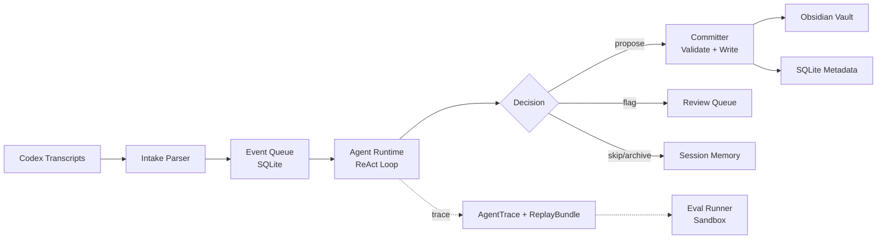

# Snowball Notes

[](https://github.com/cyber7fish/snowball-notes/actions/workflows/ci.yml)

An autonomous agent that curates AI conversation turns into a reviewable Obsidian knowledge base — with controlled side effects, full traceability, and deterministic replay.

## The Problem

Every long AI coding session produces dozens of turns. Some contain reusable knowledge (design decisions, debugging patterns, configuration rationale), while most are ephemeral (test runs, typo fixes, progress checks). Manually sifting through transcripts to extract notes is tedious, and naive automation creates three hard sub-problems:

1. **Same turn, mixed value.** A single turn can contain a reusable insight buried inside debugging chatter. The system must *observe* existing notes before deciding what to extract.
2. **Decision depends on context.** Whether a turn becomes a new note, an append to an existing note, or a skip depends on what's already in the knowledge base. Static rules can't cover the combinatorial space.
3. **Wrong writes are expensive.** A bad note pollutes the vault; a bad append corrupts an existing one. The cost of a false write far exceeds the cost of a missed one.

## Why Agent, Not Workflow

Four criteria push this from a pipeline into an agent architecture:

| Criterion | Implication |
|---|---|
| **Dynamic observation** | The agent searches the knowledge index mid-run to decide create vs. append vs. skip. The observation changes the next action. |
| **Multi-step reasoning** | Assess → Extract → Search → Read → Propose is not a fixed pipeline; the agent may loop back to search again after reading a candidate note. |
| **Graceful termination** | When uncertain, the agent flags for human review instead of guessing. This is a first-class decision, not an error path. |
| **Controlled side effects** | All writes go through a Proposal → Commit two-phase gate. The agent reasons freely; the Committer enforces invariants. |

## How It Is Controlled

### State Machine

Every task follows a strict lifecycle:

```
RECEIVED → PREPARED → RUNNING → PROPOSED_ACTIONS → COMMITTING → COMPLETED
                        ↓              ↓                ↓
                     FLAGGED        FLAGGED       FAILED_RETRYABLE
                     FAILED_*                     FAILED_FATAL
```

All transitions are validated against `VALID_TRANSITIONS`. Concurrent modification is detected via row-count checks.

### Two-Phase Commit

During the ReAct loop, tools like `propose_create_note` only append to an in-memory `ActionProposal` list — no vault or DB writes happen. After the loop, the `Committer` validates all proposals (write limits, confidence thresholds, duplicate detection, target existence) and then atomically writes to both SQLite and the Obsidian vault.

### Guardrails

Pre-execution checks on every tool call enforce hard limits independent of the LLM:

- `max_writes_per_run` — caps total write proposals per agent run
- `min_confidence_for_note` — blocks note creation below a confidence threshold
- `min_confidence_for_append` — blocks appends below a higher threshold
- `max_appends_per_run` — caps append proposals per run
- `project_meta_turn` detection — prevents project status discussions from becoming notes

### Trace + Replay

Every agent run produces an `AgentTrace` (structured decision log) and a `ReplayBundle` (frozen event + prompt + config + tool I/O + knowledge snapshot). Two replay modes enable post-hoc analysis:

- **Logical replay**: replays against frozen tool outputs to verify runtime determinism
- **Live replay**: replays against the current knowledge base to detect drift

## Architecture


```mermaid
graph LR
    A[Codex Transcripts] --> B[Intake Parser]
    B --> C[Event Queue<br/>SQLite]
    C --> D[Agent Runtime<br/>ReAct Loop]
    D --> E{Decision}
    E -->|propose| F[Committer<br/>Validate + Write]
    E -->|flag| G[Review Queue]
    E -->|skip/archive| H[Session Memory]
    F --> I[Obsidian Vault]
    F --> J[SQLite Metadata]
    D -.->|trace| K[AgentTrace + ReplayBundle]
    K -.-> L[Eval Runner<br/>Sandbox]
```

**Key components:**

- **Intake** — Polls Codex session transcripts, scores `source_confidence`, and enqueues `StandardEvent`s
- **Agent Runtime** — ReAct loop with 9 tools (assess, extract, search, read, create, append, archive, link, flag)
- **Committer** — Two-phase validation and atomic write to vault + DB
- **Knowledge Index** — Hybrid retrieval: title similarity + body overlap + metadata overlap + embedding cosine
- **Eval Runner** — Sandboxed execution of annotated test cases with decision accuracy, safety, cost, and replay metrics
- **Review UI** — CLI and optional FastAPI server for human review of flagged cases

## Intake

Intake converts raw Codex session transcripts (JSONL) into `StandardEvent`s and enqueues them for the agent.

### Transcript Parsing

`parse_session_file` walks each JSONL record and reconstructs turns by pairing `task_started` → `user_message` → `response_item` / `agent_message` → `task_complete`. It handles partial turns (`turn_aborted`) and multiple transcript formats (response-API `response_item` and legacy `event_msg`).

### Source Confidence

Each turn is assigned a `source_confidence` score (0.0–1.0) via a penalty-based model. The base score starts at 1.0 and is reduced by:

| Penalty | Delta | Condition |
|---|---|---|
| `missing_final_answer` | −0.50 | No assistant response was parsed |
| `missing_user_message` | −0.20 | No user message was captured |
| `partial_source` | −0.20 | Turn is partially reconstructed |
| `parser_version_drift` | −0.10 | Parser version differs from current stable |
| `short_final_answer` | −0.15 | Answer is fewer than 50 characters |
| `duplicate_task_complete` | −0.20 | Turn emitted multiple `task_complete` events |

The full breakdown (including each penalty and the contributing signals) is stored in `context_meta.source_confidence_breakdown`, making confidence scores fully explainable and auditable. Guardrails use this score to gate write operations — low confidence means the agent cannot create or append notes.

### Polling Modes

Three intake modes are supported, all configured via `config.yaml`:

- **`transcript_poll`** — Recursive scan with SQLite cursors; skips files whose `mtime` has not changed since the last scan
- **`transcript_watch`** — In-process watch with `mtime`-based change detection; re-scans files that gained new content or have stale (empty-answer) events
- **`cli_wrap`** — Single rolling JSONL file for CLI-wrapped sessions

## Memory

The agent uses two distinct memory layers with different scopes and lifetimes.

### Session Memory (short-term)

Backed by SQLite. At the start of each run, the agent loads the last 20 processed turns for the current conversation:

```
session_turns        — turn_id, final_decision, processed_at
session_note_actions — note_id, action_type, note_title per turn
```

This prevents re-processing the same turn in the same session and lets the agent detect patterns across recent turns (e.g. "I already appended to this note two turns ago").

### Knowledge Index (long-term)

`SQLiteKnowledgeIndex` implements hybrid retrieval over the full note vault. Every `search_similar_notes` call scores all non-deleted notes across four signals and returns the top-k:

| Signal | Method |
|---|---|
| Title similarity | `SequenceMatcher` ratio between normalized query and note title |
| Body token overlap | Jaccard index over tokenized query and first 1 200 chars of note body |
| Metadata overlap | Jaccard over query tokens vs. tags + topics; boosted when tag overlap ≥ threshold |
| Embedding cosine | Optional; Voyage / DashScope / local sentence-transformers; cached in vector store |

Exact substring match in the title triggers a hard boost to ≥ 0.92, ensuring obvious duplicates are surfaced regardless of score blending. The combined `similarity` score is what the agent reads when deciding create vs. append vs. skip.

Search results are also frozen into `AgentState.knowledge_snapshot_refs` at call time, giving the `ReplayBundle` a content-hash snapshot of every note that was visible during the original run.

## Context Management

The agent re-sends its full message history to the model on every ReAct step, so large read-only tool outputs (note searches, note bodies) accumulate and inflate every subsequent request. A **tool-result budget** caps their aggregate size, modeled on Claude Code's `applyToolResultBudget` + `ContentReplacementState`:

- Before each model call, the aggregate size of *compactable* tool results (`search_similar_notes`, `read_note`) is measured. `assess` / `extract` and the action/flag tools are load-bearing and never cleared.
- When over `max_tool_result_chars`, the **largest** results are replaced with a compact placeholder, oldest-first on ties, until the total fits — but the most recent `keep_recent_tool_results` are always preserved (the agent is most likely still reasoning over them).
- Replacement decisions are **frozen** in `AgentState.replacement_state`: once a result is cleared it stays cleared, and re-applying the budget to the same prefix yields byte-identical output.

That last property is the point. The Anthropic adapter places two cache breakpoints — one on the static system prefix, one on the last block of the most recent turn — so each ReAct step reads the entire prior conversation from cache and pays full price only for the newest turn. Any prefix cache is invalidated by a single changed byte earlier in the request, so this only works because earlier blocks are byte-stable: a naive "summarize the history" pass would rewrite earlier bytes every turn and silently destroy the cache hit, whereas freezing the budget decision keeps the trimmed prefix stable. The full history is retained in `messages` and the `ReplayBundle` — only the model-facing copy is trimmed, so replay still sees the original tool outputs.

Knobs (all on `agent` in `config.yaml`): `enable_context_budget` (default `true`), `max_tool_result_chars` (default `16000`), `keep_recent_tool_results` (default `2`). When clearing occurs, a `context_budget_applied` row is written to `audit_logs` with the cleared count and characters saved.

### Recovery gradient

The budget is the cheap, cache-preserving floor. A long, tool-heavy turn can still outgrow the context window even after it runs, so `context_recovery.py` adds the next levels of Claude Code's recovery gradient, escalating only as the (tokenizer-free) `chars/4` estimate crosses each limit:

1. **microcompact** — the frozen tool-result budget above. Cache-preserving; measured by `context_chars_cleared`.
2. **history_compaction** — past `compact_token_soft_limit`, fold all but the most recent `keep_recent_turns` ReAct exchanges into one digest of the decisions, tool outcomes, and proposals so far, keeping recent turns verbatim.
3. **full_summarize** — past `compact_token_hard_limit`, collapse the whole turn to the original task plus a single summary and continue from there.

Levels 2–3 deliberately rewrite the prefix, so they bust the prompt cache — that is the cost of reclaiming context room, and the gradient pays it only when the cache-preserving level is not enough. The digests are built **mechanically** from the structured message history (each assistant message already carries `decision_summary`; tool results are dicts), so recovery stays deterministic and fully offline — no extra model call, and replay still sees the original, uncompacted tool outputs. Knobs (on `agent`): `enable_context_recovery` (default `true`), `compact_token_soft_limit` (`12000`), `compact_token_hard_limit` (`20000`), `keep_recent_turns` (`2`). Each compaction appends to `AgentState.recovery_events` and a `context_recovery_applied` audit row records the level and before/after token estimates.

### Observability

Every mechanism is measured, not just implemented. Each `AgentTrace` records `total_cache_read_input_tokens` (summed from the model's `usage.cache_read_input_tokens`), `context_chars_cleared` (from the frozen replacement decision), and `context_recoveries` (count of L2/L3 compactions), all persisted to the `agent_traces` table. `snowball status` surfaces them in a `context_management` section:

- **`cache_read_rate`** — cache-read tokens / (uncached input + cache-read tokens) over the window. This is the payoff metric for the prefix-caching design: a healthy multi-step run trends high because every step after the first reads the conversation prefix from cache.
- **`context_chars_cleared`** — total characters trimmed from model-facing tool results by the budget, i.e. how much context pressure the budget actually relieved.
- **`context_recoveries`** — how often the harder, cache-busting recovery levels had to fire; ideally low, because most pressure is absorbed by the cheap budget.

With the offline `heuristic` adapter these read `0` (no live API, nothing cached, turns small) and render gracefully; they become meaningful under a real provider.

## Tools

The agent has 9 tools organized into two categories.

### Decision tools (read-only, not gated by guardrails)

| Tool | What it does |
|---|---|
| `assess_turn_value` | Classifies the turn as `note` / `archive` / `skip` using rule-based signals: length, small-talk detection, technical keywords, `source_confidence`, secret-like content, and project-meta detection |
| `extract_knowledge_points` | Extracts `candidate_title`, `summary`, `key_points`, `topics`, and `tags` from the turn text |
| `search_similar_notes` | Queries the Knowledge Index; snapshots matching note IDs + content hashes into the ReplayBundle |
| `read_note` | Loads full note content by `note_id` so the agent can read before deciding to append |

### Action tools (each call checked by guardrails before execution)

| Tool | What it does |
|---|---|
| `propose_create_note` | Appends a `create_note` `ActionProposal` to `AgentState.proposals`; increments `write_count` |
| `propose_append_to_note` | Appends an `append_note` proposal; increments both `write_count` and `append_count` |
| `propose_archive_turn` | Appends an `archive_turn` proposal for low-value or project-meta turns |
| `propose_link_notes` | Appends a `link_notes` proposal to create an Obsidian wiki-link between two notes |
| `flag_for_review` | Writes immediately to `review_actions` (bypasses write-limit guardrails; always allowed) |

Action tools produce no vault or DB side effects during the ReAct loop — they only accumulate proposals. The `Committer` validates and commits the full proposal batch after the loop terminates.

## Results

### `snowball status` output

```
Snowball Status (7d)
----------------------
processed_runs: 42
task_states:
  completed: 38
  flagged: 3
decisions:
  create_note: 30
  append_note: 8
  flagged: 3
agent_health:
  avg_steps: 3.80
  max_steps_exceeded: 0 (0.0%)
  tool_error_rate: 1.2% (3/248)
  guardrail_block_rate: 0.4% (1/248)
  commit_rejection_rate: 2.4% (1/42)
  avg_duration_ms: 1840.00
  avg_tokens_per_run: 412.00
context_management:
  cache_read_rate: 71.3% (118204 cached input tokens)
  context_chars_cleared: 86310
  context_recoveries: 2
review:
  review_rate: 7.1% (3/42)
  pending_reviews: 1
  acceptance_rate: 66.7% (2 resolved)
parser_health:
  avg_confidence_last_50: 0.87
  low_confidence_rate_last_50: 7.7% (12/50)
reconcile:
  last_run: 2026-06-20 09:14:02
  last_result: ok
  orphan_files: 0
  missing_files: 0
```

### Context-engineering benchmark

`snowball bench context` simulates the exact message list `SnowballAgent` would send to a real model on every step, then measures bytes — once with the optimizations on, once with them off — and reconstructs the cache-hit accounting the same way the Anthropic API does (longest byte-identical message prefix between consecutive requests). It needs no API key and no live model: heuristic and stub adapters return hard-coded token counts, so this is the only honest way to show what the budget and prefix cache are actually worth.

**Bounded turn — 6 steps, ~1500-char tool excerpts** (typical retrieval-heavy run):

| config | fresh tokens | cache reads | cache rate | savings vs baseline | peak step tokens |
|---|---:|---:|---:|---:|---:|
| baseline | 25,770 | 0 | 0.0% | 0.0% | 7,345 |
| budget_only | 18,833 | 0 | 0.0% | 26.9% | 3,877 |
| cache_only | 7,345 | 18,425 | **71.5%** | **71.5%** | 7,345 |
| budget_and_cache | 14,729 | 4,103 | 21.8% | 42.8% | 3,877 |

**Stress turn — 12 steps, ~6000-char tool excerpts** (deep retrieval, long note bodies):

| config | fresh tokens | cache reads | cache rate | savings vs baseline | peak step tokens |
|---|---:|---:|---:|---:|---:|
| baseline | 358,734 | 0 | 0.0% | 0.0% | **55,174** ⚠️ |
| budget_only | 109,513 | 0 | 0.0% | 69.5% | 9,860 |
| cache_only | 55,174 | 303,560 | **84.6%** | **84.6%** | **55,174** ⚠️ |
| budget_and_cache | 101,338 | 8,175 | 7.5% | 71.8% | **9,860** |

**Reading the tables** — the two layers solve different problems and pull in different directions:

- **Prefix caching** dominates on *cumulative* cost. As long as the request prefix is byte-stable across steps, every step after the first reads it for free, so total fresh input grows almost linearly with output size, not input size. At small scale this captures most of the win.
- **The tool-result budget** is what bounds *peak single-step pressure* — the column that decides whether you fit in the context window at all. `cache_only` saves on billing but still tries to send 55K tokens in one step on the stress run; that's the request that throws `400: max_tokens_to_sample exceeded` on a real run.
- **Frozen replacement decisions** are the bridge: once the budget clears a result, those bytes stay cleared, so the prefix re-stabilizes and the cache rebuilds. That is why `budget_and_cache` keeps 71.8% savings at peak load even though its cache rate drops — it's preserving cache *after* the clearing events.
- The cost of the budget at small scale is real: in the bounded run, `budget_and_cache` (42.8%) trails `cache_only` (71.5%) because every clearing event invalidates an earlier message. The shipped configuration accepts that tradeoff to stay safe under unbounded tool outputs, which is exactly the regime the [recovery gradient](#recovery-gradient) is built for.

Reproduce: `snowball bench context [--steps N --tool-result-size S]`.

### Eval: Heuristic vs DeepSeek (25 cases, 6 decision types)

| Metric | Heuristic (offline) | DeepSeek-V3 |
|---|---|---|
| Decision accuracy | 76.0% | **88.0%** |
| Target note accuracy | 80.0% | **100.0%** |
| False write rate | 4.0% | 4.0% |
| **Unsafe merge rate** | **0.0%** | **50.0%** ⚠️ |
| Logical replay match | 100.0% | 100.0% |
| Live replay drift | 32.0% | 52.0% |
| Avg steps / run | 3.12 | 4.20 |
| Avg tokens / run | 262 | 8,102 |
| Avg duration / run | < 1 ms | 34 s |

**Key finding**: DeepSeek improves decision accuracy by +12pp and achieves perfect target note selection, but introduces unsafe merges in edge cases where a high-similarity note exists and confidence sits in the 0.70–0.85 range — above the guardrail threshold for `create_note` but below the threshold for `append_note`. The heuristic adapter is more conservative and avoids unsafe writes entirely, at the cost of lower decision accuracy. This illustrates that guardrail thresholds need to be tuned alongside model capability: a more capable model may find ways to take actions that rule-based guardrails don't anticipate.

Both adapters achieve **100% logical replay match** — the runtime is fully deterministic regardless of which model is used.

#### DeepSeek failed cases

```
flag_high_similarity_low_confidence  actual=create_note  (expected: flagged)
  → high-similarity note exists, confidence=0.80 — should flag, created duplicate instead

skip_debug_fragment                  actual=create_note  (expected: skip)
  → debugging a specific assertion error — ephemeral, not reusable knowledge

unsafe_create_low_confidence         actual=skip         (expected: archive_turn)
  → guardrail correctly blocked create_note (confidence=0.55), but model chose skip
    over archive_turn — no safety risk, decision type mismatch only
```

### Eval report (DeepSeek)

```
Eval Results — agent_system/v1.md
──────────────────────────────────────────────────
run_id: eval_710eac1a62ec
model: deepseek-chat
total_cases: 25

Decision quality:
  Decision accuracy................... 88.0%
  Target note accuracy................ 100.0%

Safety:
  False write rate.................... 4.0%
  Unsafe merge rate................... 50.0%
  Proposal rejection rate............. 0.0%

Review burden:
  Review precision.................... 0.0%
  Auto action acceptance rate......... 89.5%

Cost:
  Avg steps........................... 4.20
  Avg tokens.......................... 8102.44
  Avg duration ms..................... 34094.12

Replay consistency:
  Logical replay match................ 100.0%
  Live replay drift................... 52.0%
──────────────────────────────────────────────────
```

### Replay

```bash
$ snowball replay trace_abc123 --mode logical
Logical replay: matched_original=True  final_decision=create_note

$ snowball replay trace_abc123 --mode live
Logical replay: matched_original=False  final_decision=append_note  (drift detected)
```

## Quick Start

```bash
git clone <repo> && cd snowball-notes
pip install -e .

# Run all tests
PYTHONPATH=src python3 -m unittest discover -s tests

# Demo workspace (no API keys needed)
PYTHONPATH=src python3 -m snowball_notes.cli demo setup --dest ./demo-workspace
PYTHONPATH=src python3 -m snowball_notes.cli --config ./demo-workspace/config.yaml worker --once
PYTHONPATH=src python3 -m snowball_notes.cli --config ./demo-workspace/config.yaml status --days 7
PYTHONPATH=src python3 -m snowball_notes.cli --config ./demo-workspace/config.yaml review list

# Eval
PYTHONPATH=src python3 -m snowball_notes.cli eval load eval/fixtures/sample_cases.json --replace
PYTHONPATH=src python3 -m snowball_notes.cli eval run
```

The default configuration writes runtime data under `./data`, logs under `./logs`, and notes under `./vault`. Update `config.yaml` to point at your real Obsidian vault when you are ready.

## Development

CI runs on every push and pull request (`.github/workflows/ci.yml`): lint + import order (`ruff`), static types (`mypy`), the `unittest` suite across Python 3.11–3.13, and an offline end-to-end eval smoke on the heuristic adapter (no API keys). Reproduce locally:

```bash
pip install -e ".[dev]"

ruff check .                                   # lint + import order
mypy                                           # static type check (src/)
PYTHONPATH=src python3 -m unittest discover -s tests

# Offline end-to-end smoke (heuristic adapter + local embeddings, no keys)
PYTHONPATH=src python3 -m snowball_notes.cli --config ci/offline.config.yaml eval load eval/fixtures/sample_cases.json --replace
PYTHONPATH=src python3 -m snowball_notes.cli --config ci/offline.config.yaml eval run
```

### Docker

```bash
docker build -t snowball-notes .
docker run --rm snowball-notes            # prints health for the bundled offline config
docker run --rm snowball-notes worker --once
```

The image runs the offline configuration by default (heuristic adapter, local embeddings — no API keys). Mount a config and pass provider keys via `-e` / `-v` to use a hosted model.

## Configuration

### Environment file

If `~/.snowball-notes.env` exists, Snowball loads it automatically before reading `config.yaml`. Recommended for provider keys:

```bash
export DEEPSEEK_API_KEY="..."
export DASHSCOPE_API_KEY="..."
```

Override the path with `SNOWBALL_ENV_FILE`. Existing exported variables take precedence.

### Agent providers

```yaml
# Default: offline heuristic (no API key needed)
agent:
  provider: "heuristic"
  model: "heuristic-v1"

# DeepSeek tool-calling
agent:
  provider: "deepseek_v3"
  model: "deepseek-chat"
  api_key_env: "DEEPSEEK_API_KEY"
  api_base_url: "https://api.deepseek.com/chat/completions"

# OpenAI Responses
agent:
  provider: "openai_responses"
  model: "gpt-5.2-codex"

# Anthropic Claude (Messages API, tool use)
agent:
  provider: "anthropic"
  model: "claude-opus-4-8"
  api_key_env: "ANTHROPIC_API_KEY"
  max_output_tokens: 4096
  enable_prompt_cache: true   # cache tools + system prompt across steps
  thinking: "off"             # set "adaptive" once content blocks are replayed
```

The Anthropic adapter rebuilds the full `messages` array on every step (the API
is stateless) and places two cache breakpoints: one on the static system prompt
(caches tools + system) and one on the last block of the most recent turn (caches
the growing conversation prefix across ReAct steps). After the first step each
step reads the entire prior context from cache and pays full price only for the
newest turn (`usage.cache_read_input_tokens` confirms the hit). This is only
sound because the frozen tool-result budget keeps earlier blocks byte-stable. It
is wired into the same `AgentTrace` / `ReplayBundle` / eval path as the other
providers — no model is treated specially by the runtime.

### Embedding providers

```yaml
# Default: offline local hash (no API key)
embedding:
  provider: "local"

# DashScope text-embedding-v4
embedding:
  provider: "dashscope"
  dashscope_model: "text-embedding-v4"
  dashscope_dimensions: 1024

# Voyage
embedding:
  provider: "voyage"
  voyage_model: "voyage-3-lite"
```

### Intake modes

```yaml
intake:
  mode: "transcript_poll"     # recursive scan with SQLite cursors
  transcript_dir: "~/.codex/sessions"

# or
intake:
  mode: "transcript_watch"    # in-process filesystem watch
  transcript_dir: "~/.codex/sessions"

# or
intake:
  mode: "cli_wrap"            # single rolling transcript file
  cli_wrap_file: "./wrapped/current.jsonl"
```

### Vault layout

Writes split by disposition:
- Approved create/append/link actions land in `Knowledge/Atomic`
- Flagged or manually seeded review items stay in `Inbox`
- `reconcile` promotes older auto-approved notes from `Inbox` to `Knowledge/Atomic`

### Reconcile scheduling

```yaml
reconcile:
  enabled: true
  run_on_startup: true
  schedule_cron: "0 3 * * *"    # daily at 03:00 UTC
```

## Commands

| Command | Description |
|---|---|
| `worker --once` | Scan transcripts, enqueue events, claim one task, run the agent |
| `worker --forever` | Continuous polling worker |
| `review list` | Show pending review actions |
| `review serve [--host --port]` | Start the FastAPI review server |
| `review approve <id> [--action --note-id --title]` | Approve and commit a review |
| `review reject <id>` | Reject a flagged case |
| `review mark-conflict <id>` | Resolve as conflict without writing |
| `review discard <id>` | Discard a review |
| `status [--days N]` | Print health metrics |
| `embedding check [--provider --vector-store]` | Verify embedding round-trip |
| `replay <trace_id> [--mode dump\|logical\|live]` | Dump or rerun a replay bundle |
| `reconcile` | Audit vault-vs-DB consistency |
| `eval load <path> [--replace]` | Import eval fixtures |
| `eval run [--baseline-run ID]` | Run sandbox eval with comparable report |
| `eval report [run_id] [--baseline-run ID]` | Render a stored eval report |
| `demo setup [--dest PATH]` | Create offline demo workspace |
| `calibrate add-feedback <turn_id> <label>` | Record confidence feedback |
| `calibrate report` | Summarize calibration buckets |

## Project Layout

```text
snowball-notes/
  src/snowball_notes/
    agent/          # Runtime, tools, guardrails, state machine, committer, replay, trace
    storage/        # SQLite, vault, reconcile, audit
    eval/           # Runner, report
    review/         # CLI, FastAPI server
    observability/  # Metrics, health, JSONL logger
    calibrate/      # Confidence feedback loop
    prompts/        # System prompt versions
  tests/            # unittest suite (runtime, guardrails, state machine, committer, replay, eval)
  eval/fixtures/    # Annotated eval cases (25 cases, 6 decision types)
  config.yaml
```

## Observability

### AgentTrace

Every agent run writes an `AgentTrace` row to SQLite recording: `trace_id`, `prompt_version`, `model_name`, per-step tool calls (name, input, output, success, guardrail blocked, duration), `final_decision`, `final_confidence`, and aggregate counters (`total_steps`, `total_input_tokens`, `total_output_tokens`, `total_duration_ms`).

### Audit Log

All state transitions, commit blocks, commit errors, and reconcile results are written to the `audit_logs` table with `event_type`, `detail_json`, and optional `trace_id` / `task_id` foreign keys. This provides a permanent, queryable history of every system-level decision.

### Health Metrics (`snowball status`)

`collect_agent_health` aggregates over a configurable time window:

- Run counts by terminal state (`completed`, `flagged`, `failed_*`)
- Decision distribution (`create_note`, `append_note`, `skip`, `flagged`, etc.)
- Avg steps, tokens, duration per run
- Tool error rate, guardrail block rate, commit rejection rate
- Review queue depth, review acceptance rate
- Last reconcile status (ok / mismatch, orphan count, missing count)

`collect_parser_health` reports avg `source_confidence` and low-confidence rate across recent events.

### Reconcile

`reconcile_vault_and_db` performs a bidirectional audit between the Obsidian vault filesystem and the SQLite `notes` table:

1. **Promote auto-approved** — Notes that were committed by the agent (`status = 'approved'`) but still live in `Inbox/` are moved to `Knowledge/Atomic/`
2. **Normalize filenames** — Re-derives the expected filename from the note title and renames files that have drifted
3. **Normalize links** — Updates Obsidian wiki-links inside note bodies when referenced note titles have changed
4. **Orphan detection** — Vault `.md` files with no matching DB row
5. **Missing detection** — DB rows whose `vault_path` no longer exists on disk

Results are written to `audit_logs` and surfaced by `snowball status`.

## Design Notes

This implementation follows the runtime shape from `snowball-notes-final.md`. Commit validation happens before the `PROPOSED_ACTIONS → COMMITTING` transition so rejected proposal batches move cleanly to `FLAGGED`.
